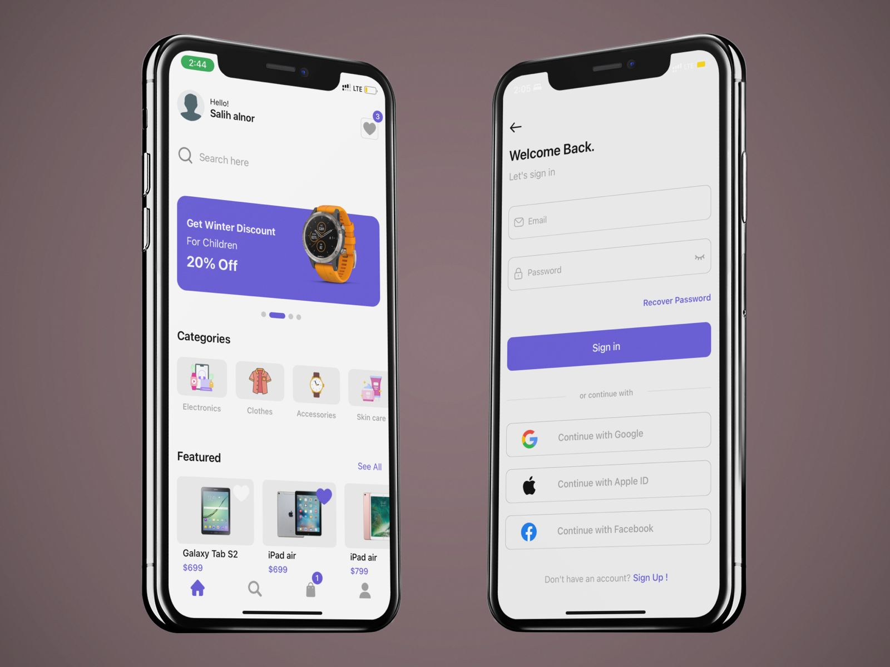
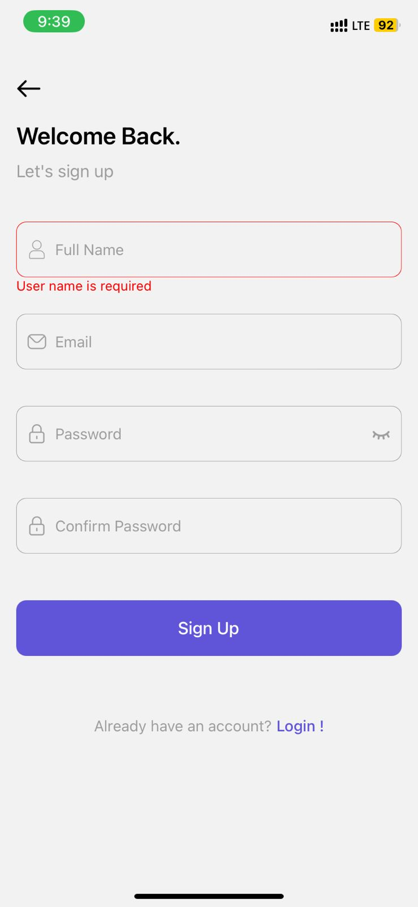
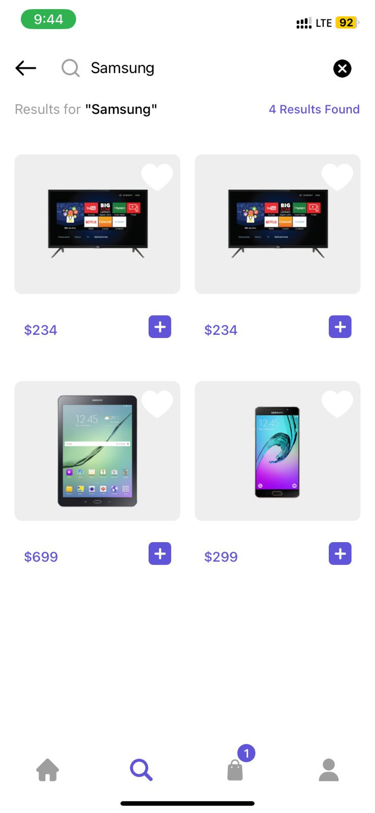

<h1>E-commerce mobile app</h1>

1 - Front-end:
 
  
- React Native

  

2 - Back-end:

  
- Node.js runtime environment
 
  
- Expriss.js Frame work

3 - Database:
 
  
- Using MongoDB

4 - State management

  
- Using Redux

5 - Auth

  
- JWT authentication

 Login screen

 Register screen

Categoris screen

SubCategoris screen

Brand screen

Search screen

Cart screen
 

Empty-cart screen

Details screen

Favorites screen

Checkout screen
 

Payment-method screen

Profile screen

