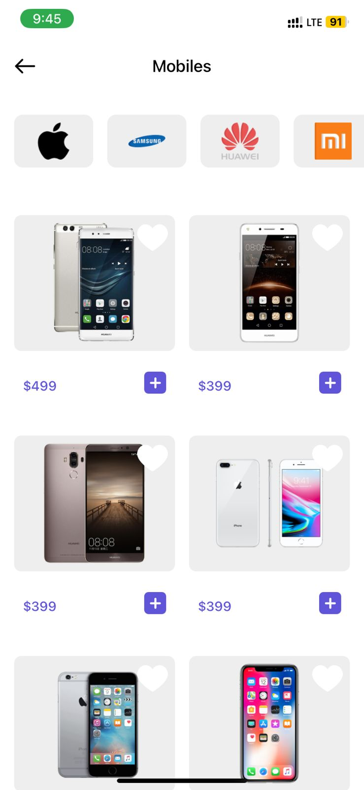

<h1>React Native E-Commerce App</h1>

A complete E-Commerce mobile application built with React Native (frontend) and Node.js + Express.js + MongoDB (backend).
The app provides a modern shopping experience with authentication, product browsing, cart, wishlist, advanced search, secure checkout with Stripe, and password hashing with bcrypt.

<h2>Features</h2>

	•	Splash & Onboarding: Introductory screens highlighting app features.

	•	Home Screen: Browse categories and featured products.

	•	Products Screen:

	•	Displays products using FlatList for efficient rendering.

	•	Each product card shows image, name, price, and quick actions (Add to Cart / Add to Favourites).

	•	Search Screen:

	•	Search products by product name or brand name.

	•	Product Details Screen:

	•	Display multiple product images using ScrollView.

	•	Show name, description, price, rating.

	•	Add to Cart and Favourites.

	•	Cart Screen:

	•	View products added to the cart.

	•	Increase or decrease product quantity with instant update of the total price.

	•	Remove a single product or clear all products at once.

	•	Proceed to Checkout.

	•	Favourites Screen:

	•	Manage favourite products.

	•	Add/remove products individually or clear all.

	•	Profile Screen:

	•	View and edit user information.

	•	Change profile picture using camera or photo gallery.

	•	Authentication (Login & Register): Secure sign-up and login.

	•	Persistent User Session: Managed with JWT and AsyncStorage.

<h2>State Management with Redux</h2>

	•	User State: Manage logged-in user data including profile picture.

<h3>	•	Cart State:</h3>

	•	Add products to cart.

	•	Increase/decrease product quantity with live price calculation.

	•	Remove single product or clear all.

	•	Sync cart data with backend via API.

	•	Favourites State:

	•	Add/remove products individually or clear all.

	•	Fetch favourite products from backend via API.

	•	Products State:

	•	Fetch product list from API.

	•	Supports filtering/search.

	•	API Integration:

	•	All cart, favourites, user profile, and product actions are synced with backend using RESTful APIs.

	•	Ensures persistent and up-to-date data across sessions and devices.

<h2>Tech Stack</h2>

<h3>Frontend</h3>

	•	React Native (Expo or CLI)

	•	Redux (State Management)

	•	AsyncStorage (Persistent User Data)

	•	Stripe SDK

	•	ScrollView (Multiple images in Product Details)

	•	FlatList (Product Listing)

	•	Image Picker / Camera Access (Profile Picture)

<h3>Backend</h3>

	•	Node.js

	•	Express.js

	•	MongoDB

	•	JWT (JSON Web Token)

	•	bcrypt (Password Hashing)

<h2>Installation & Setup</h2>

<h3>Backend</h3>

cd backend

npm install

npm start

<h3>Frontend</h3>

cd frontend

npm install

npm start

<h2>Security</h2>

	•	Password Hashing: Implemented with bcrypt before storing passwords.

	•	Authentication: Secure session management with JWT.

	•	Persistence: Tokens stored in AsyncStorage for persistent login.

<h2>Payment Integration</h2>

	•	Stripe API for card payments.

	•	Cash on Delivery and PayPal supported.

Screenshots

	•	Splash / Onboarding

	•	Home / Categories

	•	Products (FlatList)

	•	Search (by product name or brand name)

	•	Product Details (ScrollView with multiple images)

	•	Cart (Increase/decrease quantity, Remove single / Clear all products)

	•	Checkout

	•	Favourites

	•	Profile (Change profile picture via Camera or Gallery)

	•	Login / Register

  <h2>Future Improvements</h2>

	•	Push Notifications

	•	Multi-language support (i18n)

	•	Admin Dashboard for product & order management

	•	Enhanced UI/UX

![]

![]

![]

![]

 

