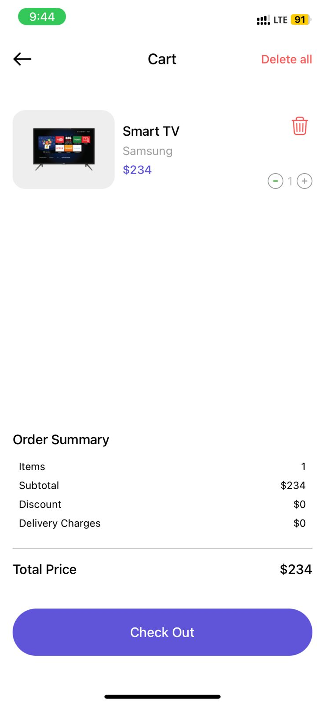
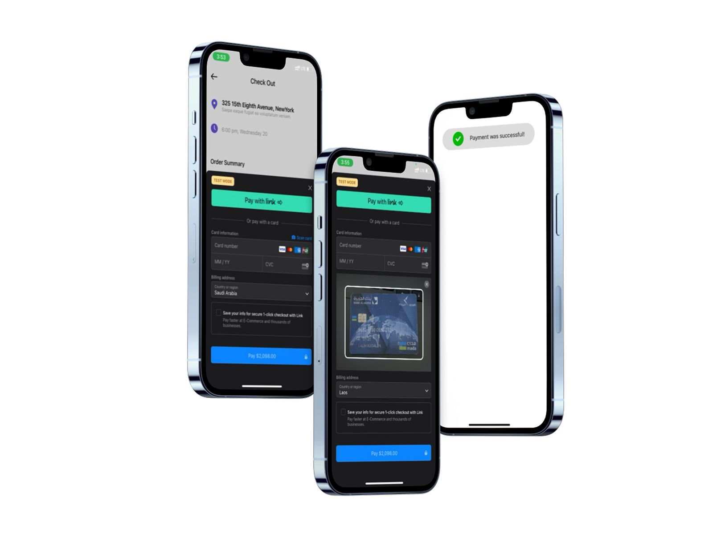

<h1>React Native E-Commerce App</h1>

A complete E-Commerce mobile application built with React Native (frontend) and Node.js + Express.js + MongoDB (backend).
The app provides a modern shopping experience with authentication, product browsing, cart, wishlist, advanced search, secure checkout with Stripe, and password hashing with bcrypt.

<h2>Features</h2>
	•	Splash & Onboarding: Introductory screens highlighting app features.
	•	Home Screen: Browse categories and featured products.
	•	Products Screen:
	•	Displays products using FlatList for efficient rendering.
	•	Each product card shows image, name, price, and quick actions (Add to Cart / Add to Favourites).
	•	Search Screen:
	•	Search products by product name or brand name.
	•	Product Details Screen:
	•	Display multiple product images using ScrollView.
	•	Show name, description, price, rating.
	•	Add to Cart and Favourites.
	•	Cart Screen:
	•	View products added to the cart.
	•	Increase or decrease product quantity with instant update of the total price.
	•	Remove a single product or clear all products at once.
	•	Proceed to Checkout.
	•	Favourites Screen:
	•	Manage favourite products.
	•	Add/remove products individually or clear all.
	•	Profile Screen:
	•	View and edit user information.
	•	Change profile picture using camera or photo gallery.
	•	Authentication (Login & Register): Secure sign-up and login.
	•	Persistent User Session: Managed with JWT and AsyncStorage.

<h2>State Management with Redux</h2>
	•	User State: Manage logged-in user data including profile picture.
	•	Cart State:
	•	Add products to cart.
	•	Increase/decrease product quantity with live price calculation.
	•	Remove single product or clear all.
	•	Sync cart data with backend via API.
	•	Favourites State:
	•	Add/remove products individually or clear all.
	•	Fetch favourite products from backend via API.
	•	Products State:
	•	Fetch product list from API.
	•	Supports filtering/search.
	•	API Integration:
	•	All cart, favourites, user profile, and product actions are synced with backend using RESTful APIs.
	•	Ensures persistent and up-to-date data across sessions and devices.

<h2>Tech Stack</h2>

<h3>Frontend</h3>
	•	React Native (Expo or CLI)
	•	Redux (State Management)
	•	AsyncStorage (Persistent User Data)
	•	Stripe SDK
	•	ScrollView (Multiple images in Product Details)
	•	FlatList (Product Listing)
	•	Image Picker / Camera Access (Profile Picture)

<h3>Backend</h3>
	•	Node.js
	•	Express.js
	•	MongoDB
	•	JWT (JSON Web Token)
	•	bcrypt (Password Hashing)

<h2>Installation & Setup</h2>

<h3>Backend</h3>
cd backend
npm install
npm start

<h3>Frontend</h3>
cd frontend
npm install
npm start

<h2>Security</h2>
	•	Password Hashing: Implemented with bcrypt before storing passwords.
	•	Authentication: Secure session management with JWT.
	•	Persistence: Tokens stored in AsyncStorage for persistent login.

<h2>Payment Integration</h2>
	•	Stripe API for card payments.
	•	Cash on Delivery and PayPal supported.

Screenshots
	•	Splash / Onboarding
	•	Home / Categories
	•	Products (FlatList)
	•	Search (by product name or brand name)
	•	Product Details (ScrollView with multiple images)
	•	Cart (Increase/decrease quantity, Remove single / Clear all products)
	•	Checkout
	•	Favourites
	•	Profile (Change profile picture via Camera or Gallery)
	•	Login / Register

  <h2>Future Improvements</h2>
	•	Push Notifications
	•	Multi-language support (i18n)
	•	Admin Dashboard for product & order management
	•	Enhanced UI/UX

![]

![]

![]

![]

 

