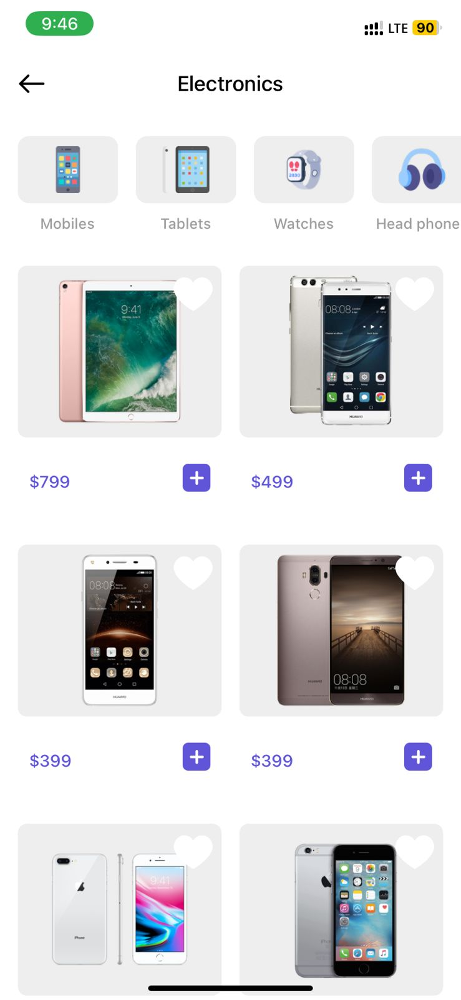
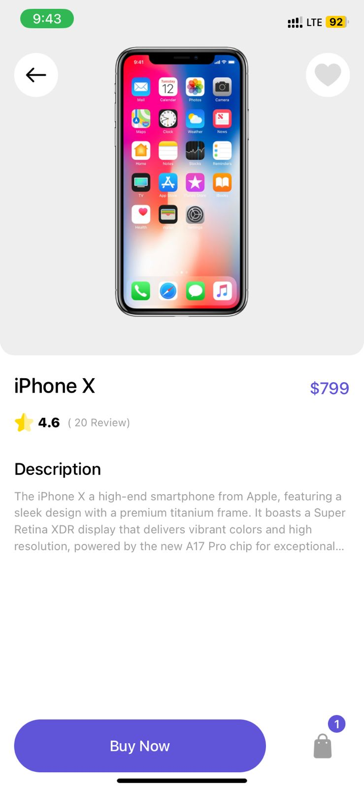
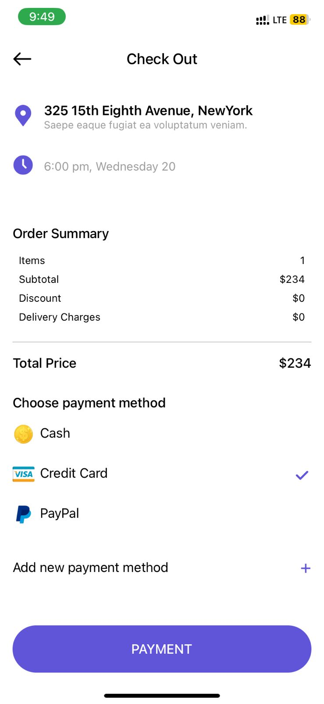

<h1>E-commerce mobile app</h1>

1 - Front-end:
 
  
- React Native

  

2 - Back-end:

  
- Node.js runtime environment
 
  
- Expriss.js Frame work

3 - Database:
 
  
- Using MongoDB

4 - State management

  
- Using Redux

5 - Auth

  
- JWT authentication

![]

![]

![]

![]

 

