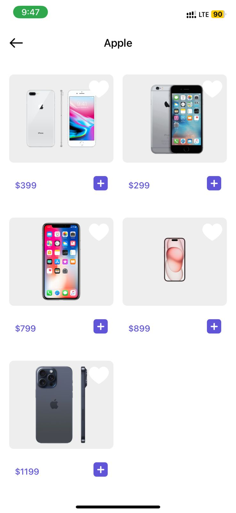
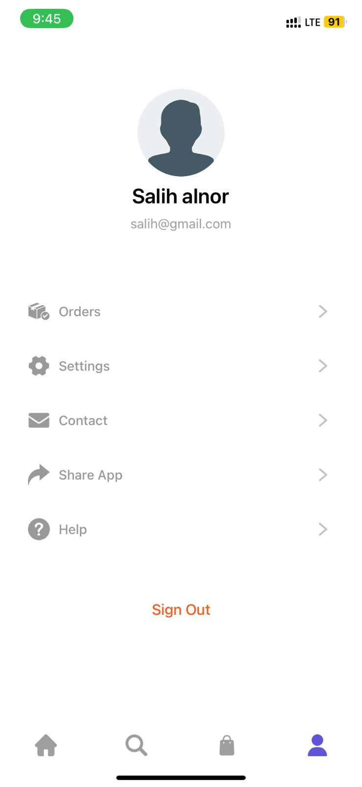

<h1>E-commerce mobile app</h1>
1 - Front-end: 
  - React Native
2 - Back-end:
  - Node.js runtime environment 
  - Expriss.js Frame work
3 - Database: 
  - Using MongoDB
4 - State management
  - Using Redux
5 - Auth
  - JWT authentication

 Home screen

 Login screen

 Register screen

Categoris screen

SubCategoris screen

Brand screen

Search screen

Cart screen
 

Empty-cart screen

Details screen

Favorites screen

Checkout screen
 

Payment-method screen

Profile screen

